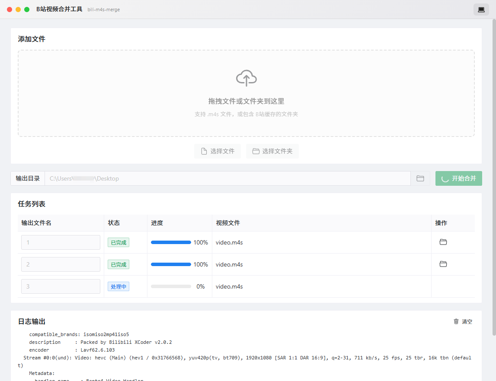

<p align="center">
  
</p>

<h1 align="center">Bilibili Video Merger</h1>
<h3 align="center">bili-m4s-merge</h3>

<p align="center">
  <strong>🎬 Cross-platform Bilibili Cache Video Merger</strong>
</p>

<p align="center">
  <a href="#-features">Features</a> •
  <a href="#-quick-start">Quick Start</a> •
  <a href="#-usage">Usage</a> •
  <a href="#%EF%B8%8F-development">Development</a> •
  <a href="./README_cn.md">中文</a>
</p>

<p align="center">
  
  
  
  
</p>

<p align="center">
  
</p>

---

## ✨ Features

| Feature | Description |
|---------|-------------|
| 🎬 **File Selection** | Drag & drop or select `.m4s` files via system dialog |
| 🔍 **Smart Detection** | Automatically handles non-standard headers in Bilibili cache files |
| ⚡ **Lossless Merge** | Uses FFmpeg codec copy - no transcoding, blazing fast |
| 📁 **Batch Processing** | Select entire Bilibili cache folder for auto-pairing |
| 📊 **Task Management** | Real-time progress and log output |
| 🌙 **Theme Switch** | Light/Dark theme with system preference support |

## 🚀 Quick Start

### Option 1: Download Release

Go to [Releases](https://github.com/Aimony/bili-m4s-merge/releases) to download the latest version.

> [!NOTE]
> The release includes bundled FFmpeg, ready to use out of the box.

### Option 2: Build from Source

#### 1. Install Dependencies

```bash
npm install
```

#### 2. Configure FFmpeg

Place `ffmpeg.exe` in the `resources/ffmpeg/` directory.

📥 Download: [ffmpeg.org](https://www.gyan.dev/ffmpeg/builds/)

#### 3. Start Development Server

```bash
npm run dev
```

#### 4. Build Production Version

```bash
npm run build:win
```

## 📖 Usage

### Single File Mode

1. Click "Select Files" or drag & drop `video.m4s` and `audio.m4s`
2. Set output directory and filename
3. Click "Start Merge"

### Batch Folder Mode

1. Click "Select Folder" and choose the Bilibili cache directory
2. The app will auto-scan and pair all mergeable files
3. Modify output filenames as needed
4. Click "Start Merge"

<details>
<summary>📂 Bilibili Cache Directory Structure</summary>

```
download/
├─115478550814377/        # Video ID
│  └─c_33618005690/
│      └─80/              # Quality
│          ├─video.m4s
│          └─audio.m4s
```

</details>

## 🛠️ Development

```bash
# Development mode
npm run dev

# Type check
npm run typecheck

# Code formatting
npm run format

# Build for Windows
npm run build:win
```

## 📄 License

MIT
